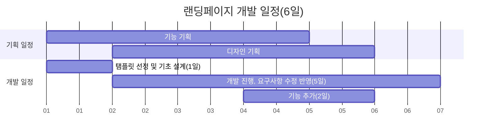

# Team3_konawa
# 프로젝트 개요
- 주제 : KVL Biz 랜딩페이지 개발
- 인원 : 2명 (메인 : 예진욱, 보조 : 박소현)
- 사용 언어 : HTML5/CSS3/JavaScript 만 사용하는 조건에서 진행. 서버 구현은 없음.
- 목적 : 배너를 통해 진입한 사용자가 Biz 도입에 관심을 가지게 하는 것.
- 구현 방향성 : 직관적인 UI, 깔끔하고 상세한 설명, 트렌디한 디자인, 차별화된 기능
- 수행 기간 : 6일

# 중간점검 이후 진행예정 사항
- ~~랜딩페이지 카드 3개짜리 버튼부분에 이미지 추가 (휑해보임)~~
- ~~랜딩페이지 그라데이션 부분에 관리자페이지 캡처 넣기 (캡처 받아야 함), 3D 카드 뒷면 캡처도 같이 받기~~
- ~~랜딩페이지 'HR관리자는 이런 복지를 원해요' -> HR 관리자 + 임직원을 포함한 단어 구상해보기~~
- ~~윗부분 CSS 속성 추가하기(대각선 슬라이드)~~
- ~~랜딩페이지 navbar 링크 설정~~
- ~~랜딩페이지 navbar 초기에 링크 안보이게~~
- ~~KONA RED 색 적용 및 모든 문구 재확인~~
- ~~랜딩페이지 최상단 동영상 추가하기 -> 동영상 소리는 한 번만 나오게(브라우저에서 소리 막아놓음)~~
- ~~중간에 카드 3개 중 버튼 삭제하고 레이아웃 다시하기~~
- ~~파일 트리 구조 분리 및 수정~~
- 각종 스크롤 애니메이션 추가하기
- 이미지에디터, 3D Card View 설명서 작성하기
- ~~이미지에디터 테마 변경, 텍스트 입력 폰트 추가~~, 카드 칩 최상단 고정시키기 -> Filerobot 내부 구조를 뜯어봐야 함. 또는 React를 알아야 함.
- ~~반응형 페이지 적용하기~~ (대각선 슬라이드 제외한 부분은 완성됨)
- 변수명, 변수 타입 리팩토링
- 구조(설계)적 관점에서 리팩토링
- 유지보수성 향상시키기(가독성, 주석 관점)

# 개인 회고_예진욱
내 직무가 프론트개발과 결이 다른 서버개발이라도 최선을 다하려 노력했지만, 
이번 개발은 내 지난 1년간 개발 경험 중 가장 최악의 코드였다. 

개발 기획부터 실제 개발까지 단 6일이란 시간이 주어졌는데, 개발 외 여러 교육으로 인해 실제 개발에 투자할 시간이 많지 않았다. 
게다가 기획과 개발을 동시에 진행하다보니 도중에 기획이 수정되면 코드를 갈아엎어야 되는 상황. 
일반적으로 개발기간이 너무 짧아 기간 내에 완수하지 못할 것 같다면 어떻게 행동할까? 
이는 개발자 면접에도 자주 나왔던 질문이기도 한데, 여기서 다른 점은 도움을 요청할 선배도 없고, 수행기간을 늘릴 수 있는 요건도 되지 않는다. 
고로 결과물의 품질이 떨어지더라도, 수행기간 내에 완수하는 것에 초점을 잡았다. 

그러다보니 겉으로 보여지는 것에만 집중했고, 당연히 구조적인 부분이나 유지보수성 등이 매우 비효율적일 수밖에 없었다. 

보다 구체적인 평가를 위해 아래와 같이 수치화해 점수를 매겨보았다. 

<주관적 평가, 5점 만점> 
1. 요구사항 만족 
    - 4점 (클라이언트, 기획이 제시한 요구사항과 대부분 일치 + 추가 기능 적용. But 허점 다수 존재) 
2. 신뢰성 
    - 3점 (여러 환경(브라우저, 의도치 않은 사용자의 행동)에서도 일관성있는 출력을 보장하기엔 약간 부족함) 
3. 성능
    - 2점 (지연시간을 줄이기 위해 구조설계, 코드를 최적화 하였는가? -> 거의 하지 못함) 
4. 유지보수성 
    - 1점 (코드의 가독성, 변수명 및 타입, 주석을 적절하게 작성하였는가? -> NO) 
5. 테스트코드
    - 1점 (테스트코드를 작성하였는가? -> NO) 
6. 개발실력 향상 
    - 2점 (Filerobot, Three.js 등 새로운 라이브러리 등을 학습하여 활용하였으나, 전체적으로 보았을 때 개발 실력이 향상되었다기에는 무리가 있음.) 
    
<b>평점 : 2.2점</b>  

개발자를 정의하자면 무엇일까? 
내가 생각하는 개발자란 요구사항에 맞는 코드를 구현할 뿐만 아니라, 다양한 환경, 성능, 차후 유지보수 등을 고려해 설계하며 지속적으로 학습하고, 성장하는 직무라고 생각한다. 
그러나, 나는 '개발'과는 동떨어진 이번 프로젝트를 수행하며 개발자로서의 자존심이 매우 상했고, 회의감 또한 많이 들었다. 
그래서 무엇을 느끼고, 어떤 행동을 취했냐? 

이번 프로젝트를 통해 개발 workflow의 중요성과, 기획이든 개발이든 서로의 직무를 조금씩은 이해할 필요가 있다고 느꼈다. 
실제로 기획과 개발이 서로의 직무를 잘 모르다보니 기획측의 요구사항과 개발측의 구현가능성이 지속적으로 대립하다가, 결국 일부는 기획과 다른 방향으로 흘러갔다.  
또한 구조설계와 유지보수성, 가독성 등의 중요성을 다시금 체감해 성장욕구를 한층 더 끌어올렸다. 

그런 의미에서 가장 먼저 시작한 것은, 
1월 27일자로 제출은 끝났지만, 퇴근 후 자투리시간을 활용해 이번 프로젝트의 코드를 하나씩 수정하며 유지보수성을 높이기 위한 유지보수, 즉 리팩토링을 하는 것이었다. 
또한 서버 개발자라도 프론트쪽 지식은 필요하며, 이번 프로젝트를 통해 React 프레임워크의 필요성을 체감해 인프런에서 React 강의를 수강할 계획을 세웠고,  
추가적으로 기획에 관련한 강의도 수강하도록 To-do List 에 추가하였다. 

# 개발환경이 아닌 파일을 받아서 실행할 때, 유의사항
javascript 보안 이슈가 있어, 실행이 되지 않는 기능이 있을 수 있음. 
chrome 확장 프로그램의 'Web Server for Chrome' 다운로드  
https://chrome.google.com/webstore/detail/web-server-for-chrome/ofhbbkphhbklhfoeikjpcbhemlocgigb  
실행 후 'Choose folder'를 클릭해 소스코드가 들어있는 폴더를 지정. 
이후 Web Server URL 의 http://127.0.0.1.~~~~ 를 클릭해서 실행한다. 

# 공유받은 참고 사이트
- 사이트 메인 컬러 선정에 도움을 주는 사이트 https://mycolor.space/   
- Gradient CSS 손 쉽게 제작하는 사이트 https://cssgradient.io/  
- 꼬불꼬불 선을 만들어주는 사이트 https://www.shapedivider.app/  
- SVG 디자인 에셋을 만들어주는 사이트 https://haikei.app/  
- 이쁜 백그라운드 이미지를 생성해주는 사이트 https://coolbackgrounds.io/  
- CSS 애니메이션 적용 도와주는 사이트 https://animate.style/
- 무료 이미지 편집기(웹사이트에서 구현X, 그냥 프로그램) https://www.gimp.org/

